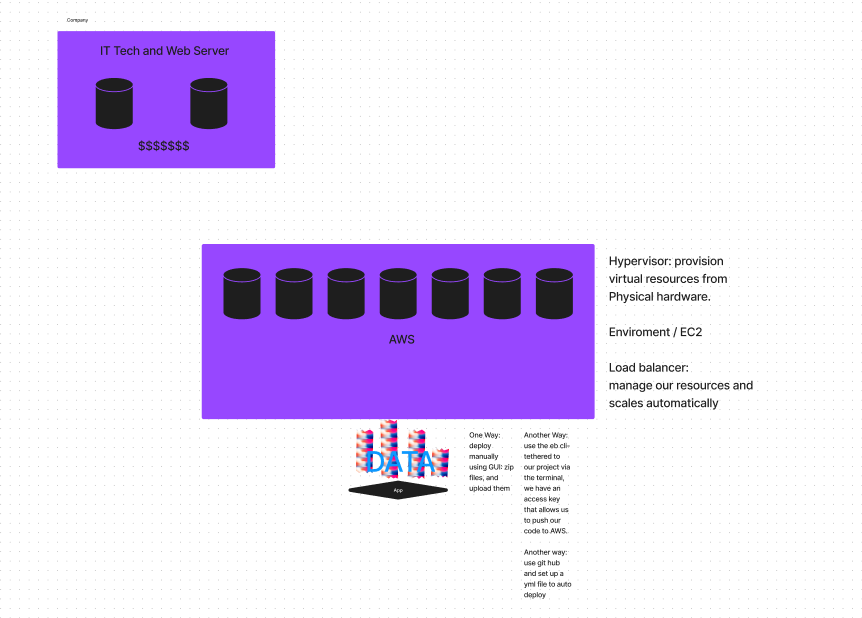

# aws-server

Created to learn and understand the process of AWS deployment.

## Server link
Banana-env.eba-7wpej32a.us-west-2.elasticbeanstalk.com

# How to deploy on AWS.

Start out by creating a service or server.

Ensure you are running Node 16 or greater as one of the json reqs.

Compress the server an package json in a server.

Create an application to deploy as a server on Elastic Beanstalk, select Node version 17.

Add compressed files into the server.

Create an AWS account. 

Use AWS configure in the terminal

Enter eb init in the terminal.

configure server region 

configure platform as 1.

Configure with code commit and select no.

Use default selector for the load balancer and no spot fleet requests.

You can than use eb deploy to deploy the server. 

